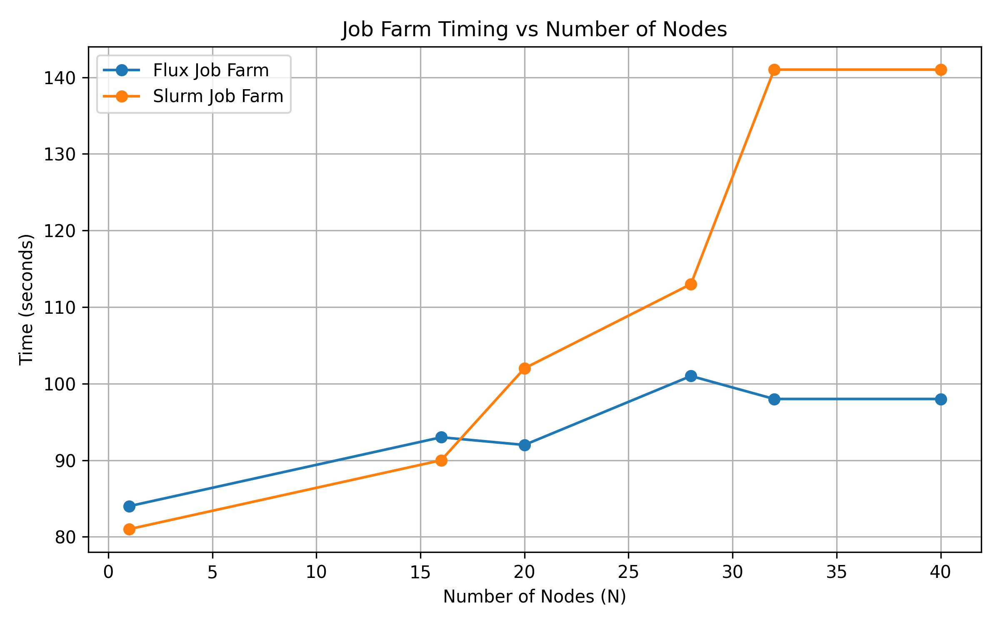

# Test and benchmark flux on Archer2

## Building

You can build flux using 

```bash
sbatch submit_build.sh
```

## Testing 
To test the task farm compile the spin executable

```bash
CC spin.cpp -O spin
```

To run the task farm

```bash
sbatch submit_task_flux_farm.sh
```

## Results (weak scaling)

I tested with a job farm executing on `N`  nodes buy over-populating with 128 ( number of cores per node  )x 2=256 tasks per node and compared overall time between slurm and flux. Cores are never over-subscribed. Extra tasks are sent in a queue by the corresponding scheduler. Without any scheduler/filesystem overheads, the whole task farm should complete in 60s, regardless of the number of nodes.

N ( number of nodes) | Time with flux (s) | Time with slurm (s)
-- |-- | --
1 | 84 | 81
16 | 93  | 90
20 | 92 | 102
28 | 101 | 113
32 | 98 | 141
40 | 98 | 141

I could also confirm that no job steps are created by flux, as expected. As such it should not pose any extra stress on the scheduler and throughput also increases significantly.
The 40 node flux test had job id 10133524.

# Plot the data

```bash
# Create the venv
python3 -m venv flux_py_env
source flux_py_env/bin/activate
python3 -m pip install --upgrade pip
python3 -m pip install -r requirements.txt 

# Plot the data
python3 plot.py
```

## Figure: Flux Job Farm Timing vs Number of Nodes



